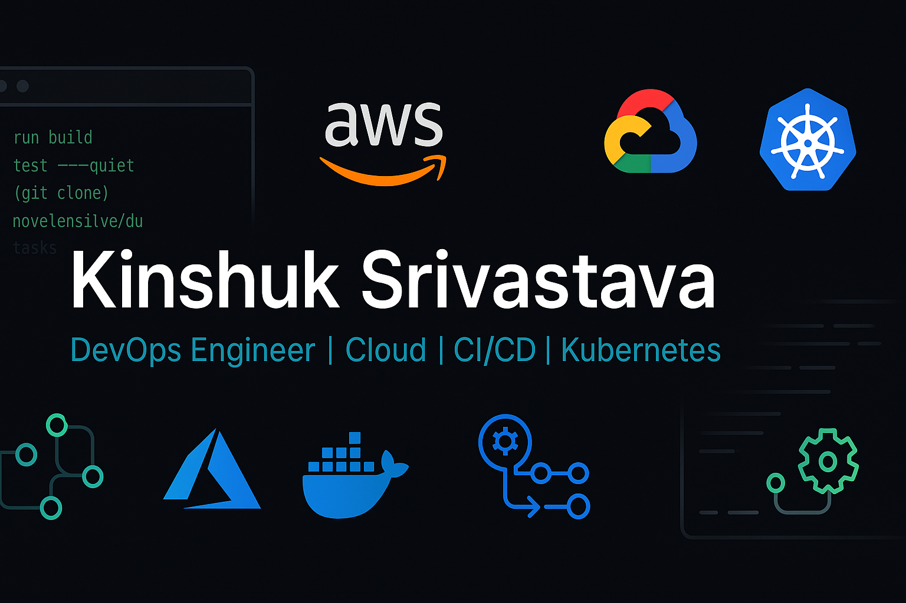

  

<h1 align="center">Hi 👋, I'm Kinshuk Srivastava</h1>
<h3 align="center">🚀 DevOps Enthusiast | Cloud Learner | Tech Explorer</h3>

  

---

### 🌟 About Me

- 💻 Working on real-world DevOps projects with **Terraform, Kubernetes, ArgoCD, and CI/CD**
- ☁️ Experienced with cloud platforms: **AWS | Azure | GCP**
- 🔐 Exploring **DevSecOps**, **Monitoring**, and **GitHub Actions**
- 📊 Currently learning: **Prometheus, Grafana, OpenTelemetry**
- 💬 Ask me about:
  - Infrastructure as Code: *Terraform, CloudFormation, OpenTofu, ARM Templates*
  - CI/CD Pipelines: *GitHub Actions, Ansible, Shell Scripting*
  - Cloud Services: *AWS Lambda, Amazon SQS, GCP Pub/Sub*
  - Kubernetes: *kubectl, namespaces, replicasets, deployments*
  - Monitoring & Automation: *CloudWatch, Triggers, SSH, Networking*

---

### 🛠️ Skill Set

#### 🔧 Core DevOps
`Linux` • `Shell Scripting` • `SSH` • `Docker` • `Kubernetes` • `Containerization` • `Virtualization` • `Networking` • `SCM (Git)`

#### 🔁 CI/CD & Automation
`GitHub Actions` • `Ansible` • `CI/CD Pipelines` • `Ansible Modules`

#### ☁️ Cloud Platforms
**AWS** → `Lambda` • `SQS` • `CloudWatch` • `CLI` • `CloudFormation`  
**GCP** → `Cloud Shell` • `gcloud` • `Pub/Sub`  
**Azure** → `ARM Templates`

#### 🧰 Infra as Code
`Terraform` • `OpenTofu` • `HashiCorp Tools`

#### 📦 Kubernetes Concepts
`kubectl` • `Namespaces` • `ReplicaSet` • `Deployments` • `YAML`

#### 📊 Monitoring & Observability
`Trivy` • `CloudWatch` • `Prometheus` • `Grafana`

---

### 💻 Tech Stack

  
  
  
  
  
  
  
  
  
  
  
  
  
  
  

---

<h2 align="center">⚡ Badges ⚡</h2>
 
    

  

  

  

---

### 📫 Connect With Me

  
  

---

  

---

